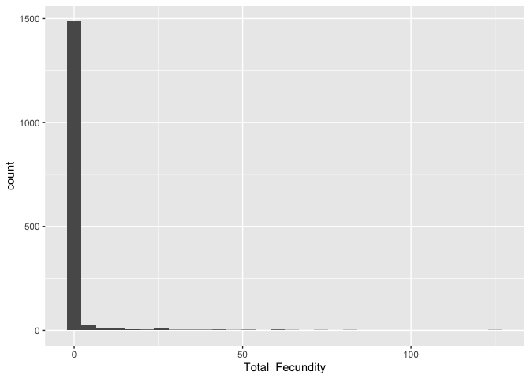
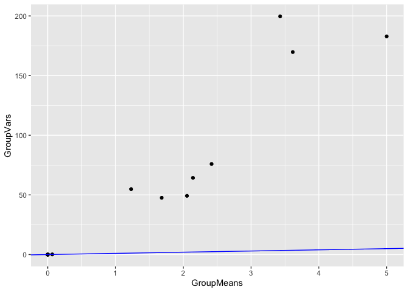
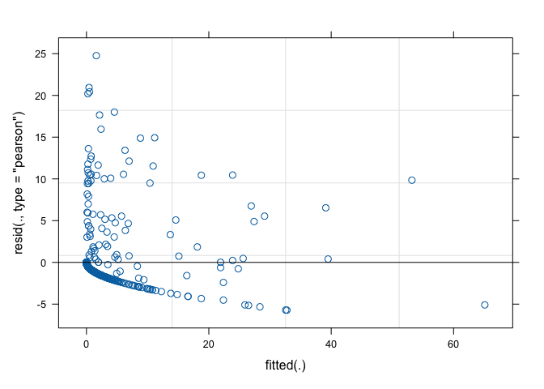
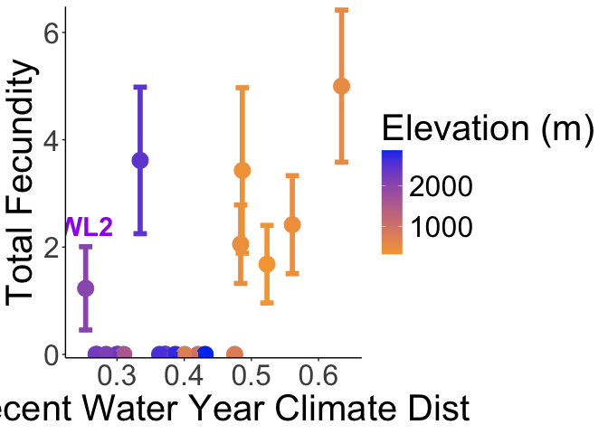

# Code for Analyzing Total Fecundity 

Equation: p(Establishment)*p(Surv to Rep - y1)*Fruits(y1) + p(Winter Surv)*p(Surv to Rep - y2)*Fruits(y2)

Calculated at the individual level 

## Libraries

``` r
library(tidyverse)
```

```
## ── Attaching core tidyverse packages ──────────────────────── tidyverse 2.0.0 ──
## ✔ dplyr     1.1.4     ✔ readr     2.1.5
## ✔ forcats   1.0.0     ✔ stringr   1.5.1
## ✔ ggplot2   3.5.1     ✔ tibble    3.2.1
## ✔ lubridate 1.9.3     ✔ tidyr     1.3.1
## ✔ purrr     1.0.2     
## ── Conflicts ────────────────────────────────────────── tidyverse_conflicts() ──
## ✖ dplyr::filter() masks stats::filter()
## ✖ dplyr::lag()    masks stats::lag()
## ℹ Use the conflicted package (<http://conflicted.r-lib.org/>) to force all conflicts to become errors
```

``` r
library(lmerTest) #mixed models
```

```
## Loading required package: lme4
## Loading required package: Matrix
## 
## Attaching package: 'Matrix'
## 
## The following objects are masked from 'package:tidyr':
## 
##     expand, pack, unpack
## 
## 
## Attaching package: 'lmerTest'
## 
## The following object is masked from 'package:lme4':
## 
##     lmer
## 
## The following object is masked from 'package:stats':
## 
##     step
```

``` r
library(broom.mixed) #tidy model
library(emmeans) #for pairwise tests
```

```
## Welcome to emmeans.
## Caution: You lose important information if you filter this package's results.
## See '? untidy'
```

``` r
library(performance) #for calculating rsq 

sem <- function(x, na.rm=FALSE) {           #for calculating standard error
  sd(x,na.rm=na.rm)/sqrt(length(na.omit(x)))
} 
```

## Read in Fitness Data

``` r
## year 1 components 
wl2_establishment <- read_csv("../Processed.Data/WL2_Establishment.csv")
```

```
## Rows: 1573 Columns: 54
## ── Column specification ────────────────────────────────────────────────────────
## Delimiter: ","
## chr   (8): block, BedLoc, bed, bed.col, Genotype, pop, bud.date, elevation.g...
## dbl  (45): bed.row, mf, rep, elev_m, Lat, Long, GD_Recent_Wtr_Year_2023, GD_...
## date  (1): death.date
## 
## ℹ Use `spec()` to retrieve the full column specification for this data.
## ℹ Specify the column types or set `show_col_types = FALSE` to quiet this message.
```

``` r
wl2_surv_to_rep_y1 <- read_csv("../Processed.Data/WL2_SurvtoRep_y1.csv")
```

```
## Rows: 728 Columns: 55
## ── Column specification ────────────────────────────────────────────────────────
## Delimiter: ","
## chr   (8): block, BedLoc, bed, bed.col, Genotype, pop, bud.date, elevation.g...
## dbl  (46): bed.row, mf, rep, elev_m, Lat, Long, GD_Recent_Wtr_Year_2023, GD_...
## date  (1): death.date
## 
## ℹ Use `spec()` to retrieve the full column specification for this data.
## ℹ Specify the column types or set `show_col_types = FALSE` to quiet this message.
```

``` r
wl2_fruits_y1 <- read_csv("../Processed.Data/WL2_Fruits_Y1.csv")
```

```
## Rows: 25 Columns: 52
## ── Column specification ────────────────────────────────────────────────────────
## Delimiter: ","
## chr  (6): block, BedLoc, bed, Genotype, pop, elevation.group
## dbl (46): mf, rep, y1_flowers, y1_fruits, FrFlN_y1, elev_m, Lat, Long, GD_Re...
## 
## ℹ Use `spec()` to retrieve the full column specification for this data.
## ℹ Specify the column types or set `show_col_types = FALSE` to quiet this message.
```

``` r
## year 2 components 
winter_surv <- read_csv("../Processed.Data/WL2_WinterSurv.csv")
```

```
## Rows: 469 Columns: 51
## ── Column specification ────────────────────────────────────────────────────────
## Delimiter: ","
## chr  (7): block, BedLoc, bed, Genotype, pop, death.date, elevation.group
## dbl (44): mf, rep, elev_m, Lat, Long, GD_Recent_Wtr_Year_2023, GD_Historic_W...
## 
## ℹ Use `spec()` to retrieve the full column specification for this data.
## ℹ Specify the column types or set `show_col_types = FALSE` to quiet this message.
```

``` r
wl2_surv_to_rep_y2 <- read_csv("../Processed.Data/WL2_Surv_to_Rep_Y2.csv")
```

```
## Rows: 135 Columns: 49
## ── Column specification ────────────────────────────────────────────────────────
## Delimiter: ","
## chr  (5): pop, Genotype, block, death.date, elevation.group
## dbl (44): mf, rep, elev_m, Lat, Long, GD_Recent_Wtr_Year_2023, GD_Historic_W...
## 
## ℹ Use `spec()` to retrieve the full column specification for this data.
## ℹ Specify the column types or set `show_col_types = FALSE` to quiet this message.
```

``` r
wl2_fruits_y2 <- read_csv("../Processed.Data/WL2_Fruits_Y2.csv")
```

```
## Rows: 74 Columns: 50
## ── Column specification ────────────────────────────────────────────────────────
## Delimiter: ","
## chr  (4): pop, Genotype, block, elevation.group
## dbl (46): mf, rep, y2_flowers, y2_fruits, FrFlN_y2, elev_m, Lat, Long, GD_Re...
## 
## ℹ Use `spec()` to retrieve the full column specification for this data.
## ℹ Specify the column types or set `show_col_types = FALSE` to quiet this message.
```

## Read in Size Pre-Transplant 

``` r
wl2_pretrans_size1 <- read_csv("../Raw.Data/WL2_DNA_Collection_Size_survey_combined20230703_corrected.csv")
```

```
## Rows: 1427 Columns: 7
## ── Column specification ────────────────────────────────────────────────────────
## Delimiter: ","
## chr (2): Pop, Notes
## dbl (5): mf, rep, DNA, height (cm), longest leaf (cm)
## 
## ℹ Use `spec()` to retrieve the full column specification for this data.
## ℹ Specify the column types or set `show_col_types = FALSE` to quiet this message.
```

``` r
wl2_pretrans_size2 <- read_csv("../Raw.Data/WL2_Extras_DNA_collection_size_survey_combined20230706_corrected.csv") %>% 
  filter(!is.na(`height (cm)`)) #to get rid of genotypes that were measured on the other data sheet (NAs on this sheet)
```

```
## Rows: 152 Columns: 7
## ── Column specification ────────────────────────────────────────────────────────
## Delimiter: ","
## chr (2): Pop, Notes
## dbl (5): mf, rep, DNA, height (cm), longest leaf (cm)
## 
## ℹ Use `spec()` to retrieve the full column specification for this data.
## ℹ Specify the column types or set `show_col_types = FALSE` to quiet this message.
```

``` r
wl2_pretrans_size_all <- bind_rows(wl2_pretrans_size1, wl2_pretrans_size2) %>%
  rename(pop=Pop, height.cm = `height (cm)`, long.leaf.cm=`longest leaf (cm)`) %>% 
  unite(Genotype, pop:rep, sep="_", remove = FALSE) %>% 
  select(-DNA)
head(wl2_pretrans_size_all)
```

```
## # A tibble: 6 × 7
##   Genotype pop      mf   rep height.cm long.leaf.cm Notes
##   <chr>    <chr> <dbl> <dbl>     <dbl>        <dbl> <chr>
## 1 CP2_1_1  CP2       1     1       0.5          1.6 KN   
## 2 CP2_1_2  CP2       1     2       0.7          1.8 KN   
## 3 CP2_1_3  CP2       1     3       1.1          1.8 KN   
## 4 CP2_1_4  CP2       1     4       0.8          1.6 KN   
## 5 CP2_1_5  CP2       1     5       0.9          1.8 KN   
## 6 CP2_1_6  CP2       1     6       1            1.9 KN
```

## Calculate Total Fecundity 

``` r
wl2_total_fecundity <- left_join(wl2_establishment, wl2_surv_to_rep_y1) %>% 
  left_join(wl2_fruits_y1) %>% 
  select(-death.date, -bud.date) %>% #remove y1 death and bud dates 
  mutate(mf=as.numeric(mf), rep=as.numeric(rep)) %>% #convert these cols to numeric for merging 
  left_join(winter_surv) %>% 
  select(-death.date) %>% 
  left_join(wl2_surv_to_rep_y2) %>% 
  left_join(wl2_fruits_y2) %>% 
  select(-death.date) %>% 
  mutate(SurvtoRep_Y1=if_else(is.na(SurvtoRep_Y1), 0, SurvtoRep_Y1),
         y1_fruits=if_else(is.na(y1_fruits), 0, y1_fruits),
         y2_fruits=if_else(is.na(y2_fruits), 0, y2_fruits),
         WinterSurv=if_else(is.na(WinterSurv), 0, WinterSurv),
         SurvtoRep_y2=if_else(is.na(SurvtoRep_y2), 0, SurvtoRep_y2)) %>% 
  mutate(Total_Fecundity=(Establishment*SurvtoRep_Y1*y1_fruits) + (WinterSurv*SurvtoRep_y2*y2_fruits)) %>% 
  left_join(wl2_pretrans_size_all)
```

```
## Joining with `by = join_by(block, BedLoc, bed, bed.row, bed.col, Genotype, pop,
## mf, rep, death.date, bud.date, elevation.group, elev_m, Lat, Long,
## GD_Recent_Wtr_Year_2023, GD_Historic_Wtr_Year_2023, GD_Recent_GrwSsn_2023,
## GD_Historic_GrwSsn_2023, GD_Recent_Wtr_Year_2024, GD_Historic_Wtr_Year_2024,
## GD_Recent_GrwSsn_2024, GD_Historic_GrwSsn_2024, `AvgGD_Historic_Growth Season`,
## `AvgGD_Historic_Water Year`, `AvgGD_Recent_Growth Season`, `AvgGD_Recent_Water
## Year`, TempDist_Historic_GrwSsn_2023, TempDist_Historic_GrwSsn_2024,
## TempDist_Historic_Wtr_Year_2023, TempDist_Historic_Wtr_Year_2024,
## TempDist_Recent_GrwSsn_2023, TempDist_Recent_GrwSsn_2024,
## TempDist_Recent_Wtr_Year_2023, TempDist_Recent_Wtr_Year_2024,
## PPTDist_Historic_GrwSsn_2023, PPTDist_Historic_GrwSsn_2024,
## PPTDist_Historic_Wtr_Year_2023, PPTDist_Historic_Wtr_Year_2024,
## PPTDist_Recent_GrwSsn_2023, PPTDist_Recent_GrwSsn_2024,
## PPTDist_Recent_Wtr_Year_2023, PPTDist_Recent_Wtr_Year_2024,
## AvgTempDist_Historic_GrwSsn, AvgTempDist_Historic_Wtr_Year,
## AvgTempDist_Recent_GrwSsn, AvgTempDist_Recent_Wtr_Year,
## AvgPPTDist_Historic_GrwSsn, AvgPPTDist_Historic_Wtr_Year,
## AvgPPTDist_Recent_GrwSsn, AvgPPTDist_Recent_Wtr_Year, Geographic_Dist,
## Elev_Dist, Establishment)`
## Joining with `by = join_by(block, BedLoc, bed, Genotype, pop, mf, rep,
## elevation.group, elev_m, Lat, Long, GD_Recent_Wtr_Year_2023,
## GD_Historic_Wtr_Year_2023, GD_Recent_GrwSsn_2023, GD_Historic_GrwSsn_2023,
## GD_Recent_Wtr_Year_2024, GD_Historic_Wtr_Year_2024, GD_Recent_GrwSsn_2024,
## GD_Historic_GrwSsn_2024, `AvgGD_Historic_Growth Season`, `AvgGD_Historic_Water
## Year`, `AvgGD_Recent_Growth Season`, `AvgGD_Recent_Water Year`,
## TempDist_Historic_GrwSsn_2023, TempDist_Historic_GrwSsn_2024,
## TempDist_Historic_Wtr_Year_2023, TempDist_Historic_Wtr_Year_2024,
## TempDist_Recent_GrwSsn_2023, TempDist_Recent_GrwSsn_2024,
## TempDist_Recent_Wtr_Year_2023, TempDist_Recent_Wtr_Year_2024,
## PPTDist_Historic_GrwSsn_2023, PPTDist_Historic_GrwSsn_2024,
## PPTDist_Historic_Wtr_Year_2023, PPTDist_Historic_Wtr_Year_2024,
## PPTDist_Recent_GrwSsn_2023, PPTDist_Recent_GrwSsn_2024,
## PPTDist_Recent_Wtr_Year_2023, PPTDist_Recent_Wtr_Year_2024,
## AvgTempDist_Historic_GrwSsn, AvgTempDist_Historic_Wtr_Year,
## AvgTempDist_Recent_GrwSsn, AvgTempDist_Recent_Wtr_Year,
## AvgPPTDist_Historic_GrwSsn, AvgPPTDist_Historic_Wtr_Year,
## AvgPPTDist_Recent_GrwSsn, AvgPPTDist_Recent_Wtr_Year, Geographic_Dist,
## Elev_Dist)`
## Joining with `by = join_by(block, BedLoc, bed, Genotype, pop, mf, rep,
## elevation.group, elev_m, Lat, Long, GD_Recent_Wtr_Year_2023,
## GD_Historic_Wtr_Year_2023, GD_Recent_GrwSsn_2023, GD_Historic_GrwSsn_2023,
## GD_Recent_Wtr_Year_2024, GD_Historic_Wtr_Year_2024, GD_Recent_GrwSsn_2024,
## GD_Historic_GrwSsn_2024, `AvgGD_Historic_Growth Season`, `AvgGD_Historic_Water
## Year`, `AvgGD_Recent_Growth Season`, `AvgGD_Recent_Water Year`,
## TempDist_Historic_GrwSsn_2023, TempDist_Historic_GrwSsn_2024,
## TempDist_Historic_Wtr_Year_2023, TempDist_Historic_Wtr_Year_2024,
## TempDist_Recent_GrwSsn_2023, TempDist_Recent_GrwSsn_2024,
## TempDist_Recent_Wtr_Year_2023, TempDist_Recent_Wtr_Year_2024,
## PPTDist_Historic_GrwSsn_2023, PPTDist_Historic_GrwSsn_2024,
## PPTDist_Historic_Wtr_Year_2023, PPTDist_Historic_Wtr_Year_2024,
## PPTDist_Recent_GrwSsn_2023, PPTDist_Recent_GrwSsn_2024,
## PPTDist_Recent_Wtr_Year_2023, PPTDist_Recent_Wtr_Year_2024,
## AvgTempDist_Historic_GrwSsn, AvgTempDist_Historic_Wtr_Year,
## AvgTempDist_Recent_GrwSsn, AvgTempDist_Recent_Wtr_Year,
## AvgPPTDist_Historic_GrwSsn, AvgPPTDist_Historic_Wtr_Year,
## AvgPPTDist_Recent_GrwSsn, AvgPPTDist_Recent_Wtr_Year, Geographic_Dist,
## Elev_Dist)`
## Joining with `by = join_by(block, Genotype, pop, mf, rep, elevation.group,
## elev_m, Lat, Long, GD_Recent_Wtr_Year_2023, GD_Historic_Wtr_Year_2023,
## GD_Recent_GrwSsn_2023, GD_Historic_GrwSsn_2023, GD_Recent_Wtr_Year_2024,
## GD_Historic_Wtr_Year_2024, GD_Recent_GrwSsn_2024, GD_Historic_GrwSsn_2024,
## `AvgGD_Historic_Growth Season`, `AvgGD_Historic_Water Year`,
## `AvgGD_Recent_Growth Season`, `AvgGD_Recent_Water Year`,
## TempDist_Historic_GrwSsn_2023, TempDist_Historic_GrwSsn_2024,
## TempDist_Historic_Wtr_Year_2023, TempDist_Historic_Wtr_Year_2024,
## TempDist_Recent_GrwSsn_2023, TempDist_Recent_GrwSsn_2024,
## TempDist_Recent_Wtr_Year_2023, TempDist_Recent_Wtr_Year_2024,
## PPTDist_Historic_GrwSsn_2023, PPTDist_Historic_GrwSsn_2024,
## PPTDist_Historic_Wtr_Year_2023, PPTDist_Historic_Wtr_Year_2024,
## PPTDist_Recent_GrwSsn_2023, PPTDist_Recent_GrwSsn_2024,
## PPTDist_Recent_Wtr_Year_2023, PPTDist_Recent_Wtr_Year_2024,
## AvgTempDist_Historic_GrwSsn, AvgTempDist_Historic_Wtr_Year,
## AvgTempDist_Recent_GrwSsn, AvgTempDist_Recent_Wtr_Year,
## AvgPPTDist_Historic_GrwSsn, AvgPPTDist_Historic_Wtr_Year,
## AvgPPTDist_Recent_GrwSsn, AvgPPTDist_Recent_Wtr_Year, Geographic_Dist,
## Elev_Dist)`
## Joining with `by = join_by(block, Genotype, pop, mf, rep, elevation.group,
## elev_m, Lat, Long, GD_Recent_Wtr_Year_2023, GD_Historic_Wtr_Year_2023,
## GD_Recent_GrwSsn_2023, GD_Historic_GrwSsn_2023, GD_Recent_Wtr_Year_2024,
## GD_Historic_Wtr_Year_2024, GD_Recent_GrwSsn_2024, GD_Historic_GrwSsn_2024,
## `AvgGD_Historic_Growth Season`, `AvgGD_Historic_Water Year`,
## `AvgGD_Recent_Growth Season`, `AvgGD_Recent_Water Year`,
## TempDist_Historic_GrwSsn_2023, TempDist_Historic_GrwSsn_2024,
## TempDist_Historic_Wtr_Year_2023, TempDist_Historic_Wtr_Year_2024,
## TempDist_Recent_GrwSsn_2023, TempDist_Recent_GrwSsn_2024,
## TempDist_Recent_Wtr_Year_2023, TempDist_Recent_Wtr_Year_2024,
## PPTDist_Historic_GrwSsn_2023, PPTDist_Historic_GrwSsn_2024,
## PPTDist_Historic_Wtr_Year_2023, PPTDist_Historic_Wtr_Year_2024,
## PPTDist_Recent_GrwSsn_2023, PPTDist_Recent_GrwSsn_2024,
## PPTDist_Recent_Wtr_Year_2023, PPTDist_Recent_Wtr_Year_2024,
## AvgTempDist_Historic_GrwSsn, AvgTempDist_Historic_Wtr_Year,
## AvgTempDist_Recent_GrwSsn, AvgTempDist_Recent_Wtr_Year,
## AvgPPTDist_Historic_GrwSsn, AvgPPTDist_Historic_Wtr_Year,
## AvgPPTDist_Recent_GrwSsn, AvgPPTDist_Recent_Wtr_Year, Geographic_Dist,
## Elev_Dist)`
## Joining with `by = join_by(Genotype, pop, mf, rep)`
```

``` r
wl2_total_fecundity %>% 
  filter(Total_Fecundity>0) %>% 
  group_by(pop) %>% 
  summarise(n=n()) %>% 
  arrange(n) #SQ1 and WR only have 1 indiv 
```

```
## # A tibble: 9 × 2
##   pop       n
##   <chr> <int>
## 1 SQ1       1
## 2 WR        1
## 3 WL2       5
## 4 CC        9
## 5 SC       11
## 6 IH       13
## 7 YO7      15
## 8 BH       16
## 9 TM2      28
```

## Check Distribution

``` r
wl2_total_fecundity %>% 
  ggplot(aes(x=Total_Fecundity)) +
  geom_histogram()
```

```
## `stat_bin()` using `bins = 30`. Pick better value with `binwidth`.
```

<!-- -->

## Try transformations

``` r
wl2_total_fecundity_transformations <-
  wl2_total_fecundity %>% 
  mutate(logTotalFecundity=log(Total_Fecundity+1),
         log10TotalFecundity=log10(Total_Fecundity+1))

wl2_total_fecundity_transformations %>% 
  ggplot(aes(x=logTotalFecundity)) +
  geom_histogram()
```

```
## `stat_bin()` using `bins = 30`. Pick better value with `binwidth`.
```

<!-- -->

``` r
wl2_total_fecundity_transformations %>% 
  ggplot(aes(x=log10TotalFecundity)) +
  geom_histogram()
```

```
## `stat_bin()` using `bins = 30`. Pick better value with `binwidth`.
```

<!-- -->

``` r
## didn't help 
```

## Scale predictors

``` r
wl2_total_fecundity_scaled <- wl2_total_fecundity %>% 
  filter(pop!="SQ1", pop!="WR") %>% 
  rename(AvgGD_Recent_Wtr_Year=`AvgGD_Recent_Water Year`,
         AvgGD_Recent_GrwSsn=`AvgGD_Recent_Growth Season`,
         AvgGD_Historic_Wtr_Year=`AvgGD_Historic_Water Year`,
         AvgGD_Historic_GrwSsn=`AvgGD_Historic_Growth Season`) %>% 
  mutate_at(c("AvgGD_Historic_GrwSsn", "AvgGD_Historic_Wtr_Year",
              "AvgGD_Recent_GrwSsn", "AvgGD_Recent_Wtr_Year",
              "AvgTempDist_Historic_GrwSsn", "AvgTempDist_Historic_Wtr_Year",
              "AvgTempDist_Recent_GrwSsn", "AvgTempDist_Recent_Wtr_Year",
              "AvgPPTDist_Historic_GrwSsn", "AvgPPTDist_Historic_Wtr_Year",
              "AvgPPTDist_Recent_GrwSsn", "AvgPPTDist_Recent_Wtr_Year",
              "Geographic_Dist"), scale)
```

## Plot group means and variances to facilitate choosing the right error distribution

``` r
wl2_total_fecundity %>% 
  group_by(pop) %>% 
  summarise(GroupMeans=mean(Total_Fecundity), GroupVars=var(Total_Fecundity)) %>% 
  ggplot(aes(x=GroupMeans, y=GroupVars)) +
  geom_point() +
  geom_abline(intercept = 0, slope=1, colour="blue")
```

<!-- -->
Based on this website, quasipoisson might work. https://r.qcbs.ca/workshop07/book-en/choose-an-error-distribution.html 

## Try models with poisson and quasi-poisson 

### Basic model - Poisson and Quasi-Poisson 

``` r
total_fecund_poisson <- glmer(Total_Fecundity ~ (1|pop/mf) + (1|block), 
                              family = poisson,
                              data=wl2_total_fecundity_scaled)
summary(total_fecund_poisson)
```

```
## Generalized linear mixed model fit by maximum likelihood (Laplace
##   Approximation) [glmerMod]
##  Family: poisson  ( log )
## Formula: Total_Fecundity ~ (1 | pop/mf) + (1 | block)
##    Data: wl2_total_fecundity_scaled
## 
##      AIC      BIC   logLik deviance df.resid 
##   5061.8   5083.1  -2526.9   5053.8     1525 
## 
## Scaled residuals: 
##     Min      1Q  Median      3Q     Max 
## -5.7240 -0.4915 -0.0045 -0.0028 24.7639 
## 
## Random effects:
##  Groups Name        Variance Std.Dev.
##  mf:pop (Intercept)  2.779   1.667   
##  pop    (Intercept) 93.453   9.667   
##  block  (Intercept)  1.197   1.094   
## Number of obs: 1529, groups:  mf:pop, 139; pop, 21; block, 13
## 
## Fixed effects:
##             Estimate Std. Error z value Pr(>|z|)    
## (Intercept)  -11.153      2.014  -5.538 3.06e-08 ***
## ---
## Signif. codes:  0 '***' 0.001 '**' 0.01 '*' 0.05 '.' 0.1 ' ' 1
```

``` r
plot(total_fecund_poisson, which = 1) #residuals plot 
```

<!-- -->

``` r
#doesn't look great
deviance(total_fecund_poisson)/df.residual(total_fecund_poisson) #check for overdispersion (caused by excess of 0s)
```

```
## [1] 2.836659
```

``` r
##try quasi-poisson model to deal with the above (and based on the above plot)
##Can't directly use quasi families with glmer so have to use Ben Bolker's quasi-likelihood adjustment function:
#https://bbolker.github.io/mixedmodels-misc/glmmFAQ.html#fitting-models-with-overdispersion
#also got help from: https://stackoverflow.com/questions/68915173/how-do-i-fit-a-quasi-poisson-model-with-lme4-or-glmmtmb
quasi_table <- function(model,ctab=coef(summary(model))) {
    phi <- sum(residuals(model, type="pearson")^2)/df.residual(model) #overdispersion parameter
    qctab <- within(as.data.frame(ctab),
    {   `Std. Error` <- `Std. Error`*sqrt(phi)
        `z value` <- Estimate/`Std. Error`
        `Pr(>|z|)` <- 2*pnorm(abs(`z value`), lower.tail=FALSE)
    })
    return(qctab)
}
printCoefmat(quasi_table(total_fecund_poisson),digits=2)
```

```
##             Estimate Std. Error z value Pr(>|z|)  
## (Intercept)    -11.2        4.6    -2.4     0.02 *
## ---
## Signif. codes:  0 '***' 0.001 '**' 0.01 '*' 0.05 '.' 0.1 ' ' 1
```

``` r
#As specified, the estimates are identical; the standard errors and p-values have been appropriately inflated, the z-values have been appropriately deflated.
```

### Add in Gowers climate distance

``` r
total_fecund_models_CD_GD <- tribble(
  ~name,          ~f,
  "1_pop.block",      "Total_Fecundity ~  (1|pop/mf) + (1|block)", 
  "2_WY_Recent",      "Total_Fecundity ~  AvgGD_Recent_Wtr_Year + Geographic_Dist + height.cm + (1|pop/mf) + (1|block)",
  "3_WY_Historical",  "Total_Fecundity ~  AvgGD_Historic_Wtr_Year + Geographic_Dist + height.cm + (1|pop/mf) + (1|block)",
  "4_GS_Recent",      "Total_Fecundity ~  AvgGD_Recent_GrwSsn + Geographic_Dist + height.cm + (1|pop/mf) + (1|block)", 
  "5_GS_Historical",  "Total_Fecundity ~  AvgGD_Historic_GrwSsn + Geographic_Dist + height.cm + (1|pop/mf) + (1|block)"
)
#run the models 
total_fecund_models_CD_GD <- total_fecund_models_CD_GD %>%
  mutate(glmer = map(f, ~ glmer(as.formula(.), 
                            family = poisson,
                            data = wl2_total_fecundity_scaled)))

#show results:
total_fecund_models_CD_GD %>% mutate(tidy=map(glmer, tidy)) %>% unnest(tidy) %>%
  select(name, term:p.value) %>% 
  filter(str_detect(term, "GD") | term=="Geographic_Dist" | term=="height.cm") %>%
  drop_na(p.value)
```

```
## # A tibble: 12 × 6
##    name            term                    estimate std.error statistic p.value
##    <chr>           <chr>                      <dbl>     <dbl>     <dbl>   <dbl>
##  1 2_WY_Recent     AvgGD_Recent_Wtr_Year      3.82     1.48      2.58   0.00994
##  2 2_WY_Recent     Geographic_Dist           -2.10     1.66     -1.26   0.207  
##  3 2_WY_Recent     height.cm                  0.135    0.0430    3.15   0.00165
##  4 3_WY_Historical AvgGD_Historic_Wtr_Year    3.60     2.03      1.78   0.0757 
##  5 3_WY_Historical Geographic_Dist           -2.47     1.85     -1.33   0.182  
##  6 3_WY_Historical height.cm                  0.136    0.0431    3.16   0.00158
##  7 4_GS_Recent     AvgGD_Recent_GrwSsn        0.107    1.36      0.0788 0.937  
##  8 4_GS_Recent     Geographic_Dist           -0.541    1.42     -0.380  0.704  
##  9 4_GS_Recent     height.cm                  0.136    0.0431    3.16   0.00160
## 10 5_GS_Historical AvgGD_Historic_GrwSsn     -0.618    1.46     -0.424  0.671  
## 11 5_GS_Historical Geographic_Dist           -0.359    1.28     -0.280  0.779  
## 12 5_GS_Historical height.cm                  0.136    0.0431    3.16   0.00159
```

``` r
#quasi-poisson correction:
phi_function <- function(model) {
    phi <- sum(residuals(model, type="pearson")^2)/df.residual(model) 
    return(phi)
} #function for calculating the overdispersion paramter

total_fecund_models_CD_GD %>% 
  mutate(phi=map(glmer, phi_function)) %>% 
  mutate(tidy=map(glmer, tidy)) %>% 
  unnest(tidy) %>% 
  unnest(phi) %>% 
  transmute(term = term, estimate = estimate, 
                std.error = std.error * sqrt(phi),
                statistic = estimate/std.error,
                p.value = 2*pnorm(abs(statistic), lower.tail=FALSE)) %>% 
  filter(str_detect(term, "GD") | term=="Geographic_Dist" | term=="height.cm") %>%
  drop_na(p.value) #after correction, no clim dist sig
```

```
## # A tibble: 12 × 5
##    term                    estimate std.error statistic p.value
##    <chr>                      <dbl>     <dbl>     <dbl>   <dbl>
##  1 AvgGD_Recent_Wtr_Year      3.82     3.41      1.12     0.263
##  2 Geographic_Dist           -2.10     3.83     -0.548    0.584
##  3 height.cm                  0.135    0.0992    1.36     0.172
##  4 AvgGD_Historic_Wtr_Year    3.60     4.68      0.771    0.441
##  5 Geographic_Dist           -2.47     4.28     -0.579    0.563
##  6 height.cm                  0.136    0.0993    1.37     0.171
##  7 AvgGD_Recent_GrwSsn        0.107    3.13      0.0342   0.973
##  8 Geographic_Dist           -0.541    3.28     -0.165    0.869
##  9 height.cm                  0.136    0.0993    1.37     0.171
## 10 AvgGD_Historic_GrwSsn     -0.618    3.36     -0.184    0.854
## 11 Geographic_Dist           -0.359    2.95     -0.121    0.903
## 12 height.cm                  0.136    0.0993    1.37     0.171
```

``` r
total_fecund_models_CD_GD %>% mutate(rsq=map(glmer, r2)) %>% 
  unnest(rsq) %>% 
  unnest(rsq) %>% 
  select(-f:-glmer)
```

```
## # A tibble: 10 × 2
##    name                rsq
##    <chr>             <dbl>
##  1 1_pop.block     1      
##  2 1_pop.block     0      
##  3 2_WY_Recent     1      
##  4 2_WY_Recent     0.361  
##  5 3_WY_Historical 1      
##  6 3_WY_Historical 0.257  
##  7 4_GS_Recent     1      
##  8 4_GS_Recent     0.00350
##  9 5_GS_Historical 1      
## 10 5_GS_Historical 0.00849
```

``` r
#pairwise test between WL2 and BH (the pop with the highest total fecundity):
wtr_yr_recent_mod <- glmer(Total_Fecundity ~  AvgGD_Recent_Wtr_Year + Geographic_Dist + height.cm + (1|pop/mf) + (1|block), family = poisson, data = wl2_total_fecundity_scaled)
#get min and max GD
min(wl2_total_fecundity_scaled$AvgGD_Recent_Wtr_Year) 
```

```
## [1] -1.358033
```

``` r
max(wl2_total_fecundity_scaled$AvgGD_Recent_Wtr_Year)
```

```
## [1] 2.153113
```

``` r
minmaxGD = list(AvgGD_Recent_Wtr_Year = c(-1.358033, 2.153113))

# Calculate EMMs at the min and max GD
emm_results <- emmeans(wtr_yr_recent_mod, ~ AvgGD_Recent_Wtr_Year, at = minmaxGD)
# View the results
summary(emm_results)
```

```
##  AvgGD_Recent_Wtr_Year  emmean   SE  df asymp.LCL asymp.UCL
##                  -1.36 -12.847 3.21 Inf    -19.13     -6.56
##                   2.15   0.552 3.17 Inf     -5.66      6.77
## 
## Results are given on the log (not the response) scale. 
## Confidence level used: 0.95
```

``` r
# Perform pairwise comparison
pairs(emm_results) 
```

```
##  contrast                                                         estimate  SE
##  (AvgGD_Recent_Wtr_Year-1.358033) - AvgGD_Recent_Wtr_Year2.153113    -13.4 5.2
##   df z.ratio p.value
##  Inf  -2.578  0.0099
## 
## Results are given on the log (not the response) scale.
```

``` r
#P=0.0099
#but this is based off the poisson model, not the quasi-poisson...
```

### Temp/ppt dist

``` r
total_fecund_SUB_models_CD_GD <- tribble(
  ~name,          ~f,
  "1_pop.block",      "Total_Fecundity ~  (1|pop/mf) + (1|block)", 
  "2_WY_Recent",      "Total_Fecundity ~  AvgTempDist_Recent_Wtr_Year + AvgPPTDist_Recent_Wtr_Year + Geographic_Dist + height.cm + (1|pop/mf) + (1|block)",
  "3_WY_Historical",  "Total_Fecundity ~  AvgTempDist_Historic_Wtr_Year + AvgPPTDist_Historic_Wtr_Year + Geographic_Dist + height.cm + (1|pop/mf) + (1|block)",
  "4_GS_Recent",      "Total_Fecundity ~  AvgTempDist_Recent_GrwSsn + AvgPPTDist_Recent_GrwSsn + Geographic_Dist + height.cm + (1|pop/mf) + (1|block)", 
  "5_GS_Historical",  "Total_Fecundity ~  AvgTempDist_Historic_GrwSsn + AvgPPTDist_Historic_GrwSsn + Geographic_Dist + height.cm + (1|pop/mf) + (1|block)"
)

#run the models 
total_fecund_SUB_models_CD_GD <- total_fecund_SUB_models_CD_GD %>%
  mutate(glmer = map(f, ~ glmer(as.formula(.), 
                            family = poisson,
                            data = wl2_total_fecundity_scaled)))
```

```
## Warning: There were 4 warnings in `mutate()`.
## The first warning was:
## ℹ In argument: `glmer = map(f, ~glmer(as.formula(.), family = poisson, data =
##   wl2_total_fecundity_scaled))`.
## Caused by warning in `checkConv()`:
## ! Model failed to converge with max|grad| = 0.122604 (tol = 0.002, component 1)
## ℹ Run `dplyr::last_dplyr_warnings()` to see the 3 remaining warnings.
```

``` r
#convergence warning for water year recent model 

#show results:
total_fecund_SUB_models_CD_GD %>% mutate(tidy=map(glmer, tidy)) %>% unnest(tidy) %>%
  select(name, term:p.value) %>% 
  filter(str_detect(term, "GD") | term=="Geographic_Dist" | term=="height.cm") %>%
  drop_na(p.value)
```

```
## # A tibble: 8 × 6
##   name            term            estimate std.error statistic p.value
##   <chr>           <chr>              <dbl>     <dbl>     <dbl>   <dbl>
## 1 2_WY_Recent     Geographic_Dist   -1.24   0.000581 -2140.    0      
## 2 2_WY_Recent     height.cm          0.135  0.000581   232.    0      
## 3 3_WY_Historical Geographic_Dist   -1.04   0.000600 -1736.    0      
## 4 3_WY_Historical height.cm          0.138  0.000600   230.    0      
## 5 4_GS_Recent     Geographic_Dist   -0.341  1.22        -0.279 0.780  
## 6 4_GS_Recent     height.cm          0.136  0.0431       3.15  0.00162
## 7 5_GS_Historical Geographic_Dist   -0.366  1.20        -0.305 0.761  
## 8 5_GS_Historical height.cm          0.135  0.0431       3.15  0.00166
```

``` r
#quasi-poisson correction:
total_fecund_SUB_models_CD_GD %>% 
  mutate(phi=map(glmer, phi_function)) %>% 
  mutate(tidy=map(glmer, tidy)) %>% 
  unnest(tidy) %>% 
  unnest(phi) %>% 
  transmute(term = term, estimate = estimate,
                std.error = std.error * sqrt(phi),
                statistic = estimate/std.error,
                p.value = 2*pnorm(abs(statistic), lower.tail=FALSE)) %>% 
  filter(str_detect(term, "GD") | term=="Geographic_Dist" | term=="height.cm") %>%
  drop_na(p.value) 
```

```
## # A tibble: 8 × 5
##   term            estimate std.error statistic p.value
##   <chr>              <dbl>     <dbl>     <dbl>   <dbl>
## 1 Geographic_Dist   -1.24    0.00134  -928.      0    
## 2 height.cm          0.135   0.00134   101.      0    
## 3 Geographic_Dist   -1.04    0.00139  -753.      0    
## 4 height.cm          0.138   0.00138    99.9     0    
## 5 Geographic_Dist   -0.341   2.82       -0.121   0.904
## 6 height.cm          0.136   0.0993      1.37    0.172
## 7 Geographic_Dist   -0.366   2.77       -0.132   0.895
## 8 height.cm          0.135   0.0993      1.36    0.173
```

``` r
total_fecund_SUB_models_CD_GD %>% mutate(rsq=map(glmer, r2)) %>% 
  unnest(rsq) %>% 
  unnest(rsq) %>% 
  select(-f:-glmer)
```

```
## # A tibble: 10 × 2
##    name              rsq
##    <chr>           <dbl>
##  1 1_pop.block     1    
##  2 1_pop.block     0    
##  3 2_WY_Recent     1    
##  4 2_WY_Recent     0.560
##  5 3_WY_Historical 1    
##  6 3_WY_Historical 0.555
##  7 4_GS_Recent     1    
##  8 4_GS_Recent     0.132
##  9 5_GS_Historical 1    
## 10 5_GS_Historical 0.174
```

``` r
#investigate water year recent model:
mod_test <- glmer(Total_Fecundity ~ AvgTempDist_Recent_Wtr_Year + AvgPPTDist_Recent_Wtr_Year + Geographic_Dist + (1|pop/mf) + (1|block), 
                              family = poisson,
                              data=wl2_total_fecundity_scaled)
```

```
## Warning in checkConv(attr(opt, "derivs"), opt$par, ctrl = control$checkConv, :
## Model failed to converge with max|grad| = 0.121913 (tol = 0.002, component 1)
```

```
## Warning in checkConv(attr(opt, "derivs"), opt$par, ctrl = control$checkConv, : Model is nearly unidentifiable: very large eigenvalue
##  - Rescale variables?
```

``` r
summary(mod_test)
```

```
## Generalized linear mixed model fit by maximum likelihood (Laplace
##   Approximation) [glmerMod]
##  Family: poisson  ( log )
## Formula: 
## Total_Fecundity ~ AvgTempDist_Recent_Wtr_Year + AvgPPTDist_Recent_Wtr_Year +  
##     Geographic_Dist + (1 | pop/mf) + (1 | block)
##    Data: wl2_total_fecundity_scaled
## 
##      AIC      BIC   logLik deviance df.resid 
##   5060.5   5097.8  -2523.3   5046.5     1522 
## 
## Scaled residuals: 
##     Min      1Q  Median      3Q     Max 
## -5.7237 -0.4918 -0.0159 -0.0045 24.7762 
## 
## Random effects:
##  Groups Name        Variance Std.Dev.
##  mf:pop (Intercept)  2.706   1.645   
##  pop    (Intercept) 16.357   4.044   
##  block  (Intercept)  1.239   1.113   
## Number of obs: 1529, groups:  mf:pop, 139; pop, 21; block, 13
## 
## Fixed effects:
##                               Estimate Std. Error z value Pr(>|z|)    
## (Intercept)                 -7.7856637  0.0005817  -13383   <2e-16 ***
## AvgTempDist_Recent_Wtr_Year  2.9488529  0.0005817    5069   <2e-16 ***
## AvgPPTDist_Recent_Wtr_Year  -2.5777208  0.0005817   -4431   <2e-16 ***
## Geographic_Dist             -1.1195574  0.0005817   -1925   <2e-16 ***
## ---
## Signif. codes:  0 '***' 0.001 '**' 0.01 '*' 0.05 '.' 0.1 ' ' 1
## 
## Correlation of Fixed Effects:
##             (Intr) ATD_R_ APPTD_
## AvgTD_R_W_Y 0.000               
## APPTD_R_W_Y 0.000  0.000        
## Gegrphc_Dst 0.000  0.000  0.000 
## optimizer (Nelder_Mead) convergence code: 0 (OK)
## Model failed to converge with max|grad| = 0.121913 (tol = 0.002, component 1)
## Model is nearly unidentifiable: very large eigenvalue
##  - Rescale variables?
```

``` r
#Warning: Model failed to converge with max|grad| = 0.121913 (tol = 0.002, component 1)Warning: Model is nearly unidentifiable: very large eigenvalue
 #- Rescale variables?
```

## Figures

``` r
total_fecund_summary <- wl2_total_fecundity %>% 
  filter(pop!="SQ1", pop!="WR") %>% 
  rename(AvgGD_Recent_Water_Yr=`AvgGD_Recent_Water Year`) %>% 
  group_by(pop, elev_m, AvgGD_Recent_Water_Yr) %>% 
  summarise(meanTotalFecund=mean(Total_Fecundity, na.rm=TRUE), semEst=sem(Total_Fecundity, na.rm=TRUE))
```

```
## `summarise()` has grouped output by 'pop', 'elev_m'. You can override using the
## `.groups` argument.
```

``` r
total_fecund_summary %>% arrange(meanTotalFecund) #BH had the highest total fecundity 
```

```
## # A tibble: 21 × 5
## # Groups:   pop, elev_m [21]
##    pop   elev_m AvgGD_Recent_Water_Yr meanTotalFecund semEst
##    <chr>  <dbl>                 <dbl>           <dbl>  <dbl>
##  1 CP2    2244.                 0.269               0      0
##  2 CP3    2266.                 0.270               0      0
##  3 DPR    1019.                 0.421               0      0
##  4 FR      787                  0.475               0      0
##  5 LV1    2593.                 0.371               0      0
##  6 LV3    2354.                 0.372               0      0
##  7 LVTR1  2741.                 0.387               0      0
##  8 SQ2    1934.                 0.300               0      0
##  9 SQ3    2373.                 0.301               0      0
## 10 WL1    1614.                 0.310               0      0
## # ℹ 11 more rows
```

``` r
total_fecund_summary %>% 
  ggplot(aes(x=AvgGD_Recent_Water_Yr, y=meanTotalFecund, group = pop, color=elev_m)) +
  scale_colour_gradient(low = "#F5A540", high = "#0043F0") +
  geom_point(size=6) + 
  geom_errorbar(aes(ymin=meanTotalFecund-semEst,ymax=meanTotalFecund+semEst),width=.02,linewidth = 2) +
  theme_classic() + 
  scale_y_continuous(expand = c(0.01, 0)) +
  labs(y="Total Fecundity", x="Recent Water Year Climate Dist", 
       color="Elevation (m)") +
  annotate("text", x = 0.2532683, y= 2.4, label = "WL2", 
           colour = "purple", fontface="bold", size = 22 / .pt) +
  theme(text=element_text(size=30))
```

<!-- -->

``` r
ggsave("../Figures/Indiv_Fit_Comps/TotalFecund_GD_Recent_WtrYr.png",
       width = 12, height = 6, units = "in")
```
